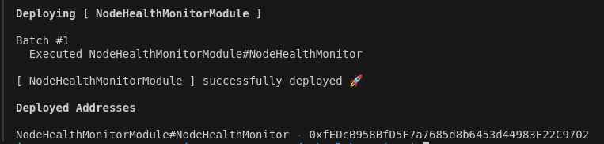

# Node Health Monitor — Deploy e Monitoramento de Nós em Blockchain
Este projeto fornece uma estrutura para monitorar a saúde de nós em uma rede blockchain usando contratos inteligentes. Ele inclui um contrato principal chamado NodeHealthMonitor, que permite o registro descentralizado do status de operação de nós por diferentes participantes da rede.

## Requisitos

- Node.js v16+
- Hardhat
- npm


Antes de iniciar o deploy, certifique-se de configurar o arquivo hardhat.config.ts com os dados corretos da sua rede:
```
networks: {
  local: {
    url: "http://127.0.0.1:8545", // ou o endereço da sua rede
    accounts: ["SUA_CHAVE_PRIVADA"]
  }
}
```
## Instale as dependências e compile os contratos: 

```shell
npm install
npx hardhat compile
```

# Deploy e Inicializaçao de contratos 
Após configurar sua rede, você pode proceder com o deploy e a inicialização dos contratos. Aqui está uma breve descrição do contrato e o processo de inicialização:
 ## Node Health Monitor
 Esse contrato permite que nós da rede relatem seu status atual, incluindo:
* severity: severidade do status (0 = OK, 1 = Warning, 2 = Critical)
* statusHash: hash representando um resumo das métricas (para preservar privacidade)
* optionalDetails: informações adicionais opcionais (obrigatórias em casos críticos)

- ### reportStatus:
  Registra um novo status para o nó.
- ### getLatestStatus
  Retorna o relatório de status mais recente de um nó.
- ### Eventos:
  * StatusReported: Emitido sempre que um status for registrado.
  * CriticalAlert: Emitido somente em casos críticos, com detalhes adicionais.

## Executando o Deploy e Inicialização

 Rode o seguinte comando para realizar o deploy dos contratos e inicializá-los na rede:

```shell
npx hardhat ignition deploy ./ignition/modules/NodeHealthMonitor.ts --network local
```

## Endereços dos Contratos

Após a execução do comando, você verá os endereços dos contratos no terminal. Esses endereços são importantes para interagir com os contratos já implantados.

